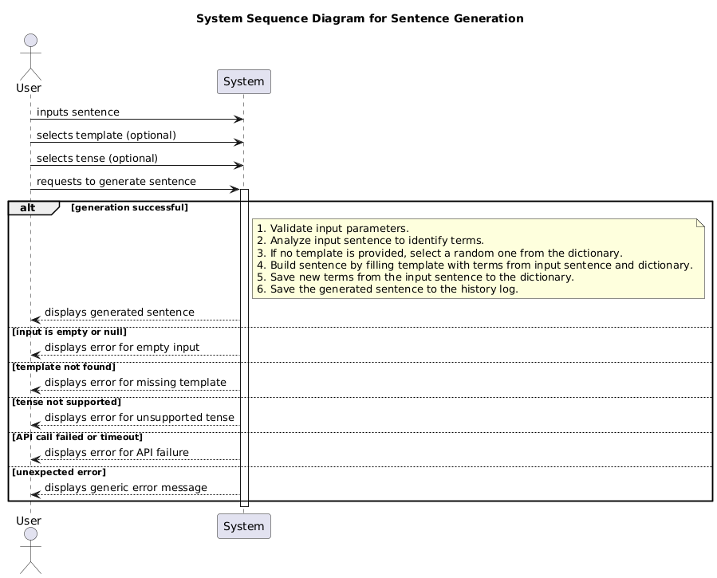
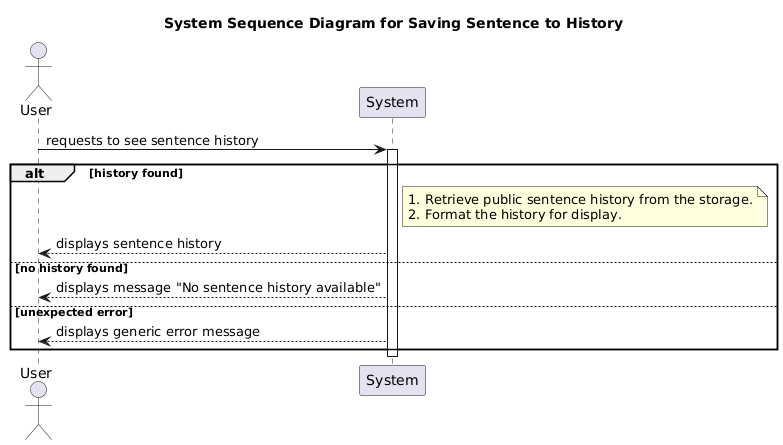
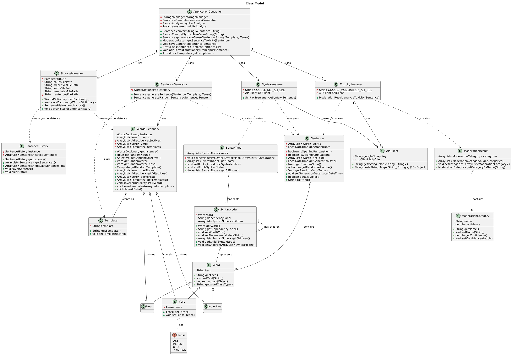

# Design Document
## Domain Model

## System Sequence Diagrams
### Syntax Analysis

### Sentence Generation

### Toxicity Analysis

### Visualizing the Sentence History

## Design Class Model

### Used Design Patterns

Our project's architecture is shaped by several key design patterns that help us manage complexity, improve flexibility, and keep the code maintainable. Here’s a look at the patterns we've employed:

-   **Singleton**: We've used the Singleton pattern for the `WordsDictionary` and `SentenceHistory` classes. This ensures that there's only one, globally accessible instance for each. It's crucial for maintaining a consistent state for our word collection and the history of generated sentences across the entire application.
-   **Factory Method (Simple Factory)**: The `SentenceGenerator` class acts as a factory. It encapsulates the complex logic of creating `Sentence` objects. This decouples the rest of the application from the specifics of sentence construction, allowing us to change how sentences are built without affecting the code that requests them.
-   **Facade**: The `ApplicationController` serves as a Facade, providing a simple and clean interface to the more complex underlying subsystems. It coordinates the `SentenceGenerator`, `SyntaxAnalyzer`, `ToxicityAnalyzer`, and `StorageManager`, so the client only needs to interact with this single entry point through the `ApplicationRestController` endpoints.
-   **Repository (DAO)**: Our `StorageManager` class implements the Repository pattern. It abstracts and handles all the details of data persistence (reading from and writing to files). This isolates the data access logic, meaning we could swap our storage mechanism (e.g., from files to a database) with minimal impact on the rest of the system.
-   **Composite**: The `SyntaxTree` and `SyntaxNode` classes work together to form a Composite pattern. This allows us to build a tree structure representing a sentence's syntax and treat both individual words (`SyntaxNode`) and the entire tree (`SyntaxTree`) in a uniform way.
-   **Adapter**: The `APIClient` class functions as an Adapter. It translates requests from our application into the format required by the external Google NLP and Moderation APIs, hiding the complexity of the direct API communication from the `SyntaxAnalyzer` and `ToxicityAnalyzer`.
-   **Strategy**: The use of `Template` objects within the `SentenceGenerator` hints at the Strategy pattern. Each template defines a different "strategy" or structure for creating a sentence. This allows us to easily add new sentence structures by simply creating new templates, without modifying the generator itself.

## Internal Sequence Diagrams
### Sentence Generation

### Syntax Analysis

### Toxicity Analysis

### Visualizing the Sentence History
