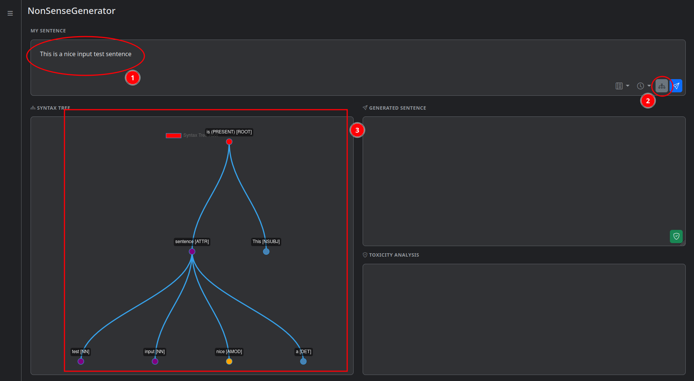
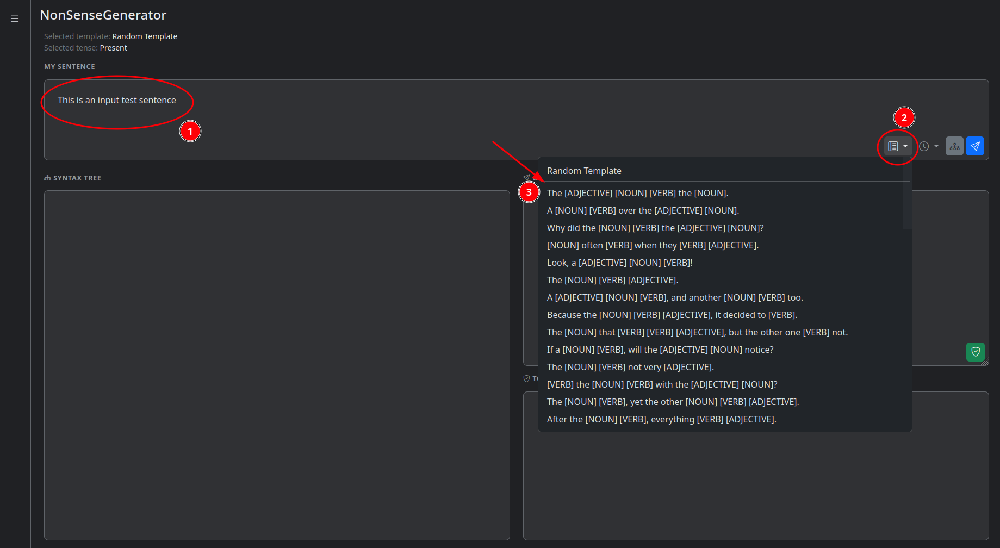
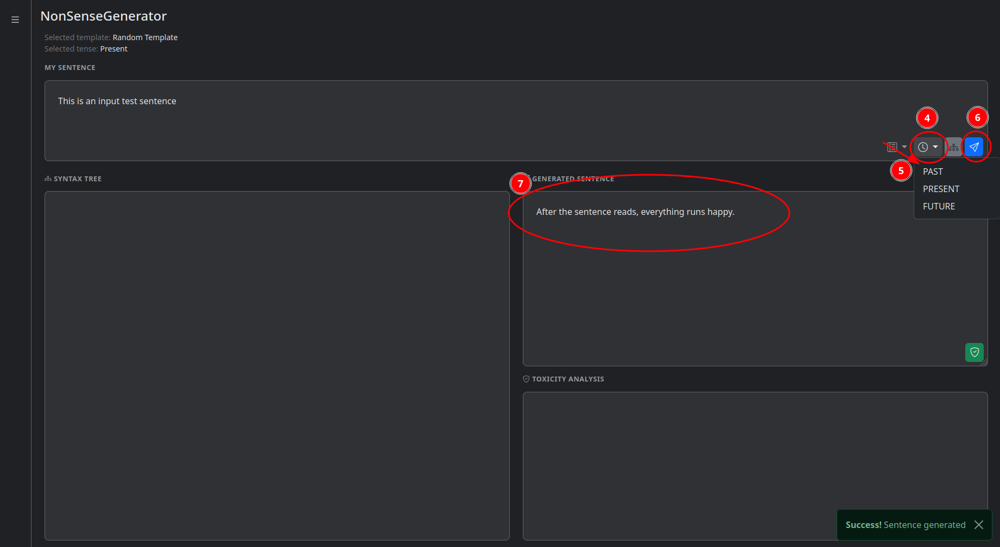
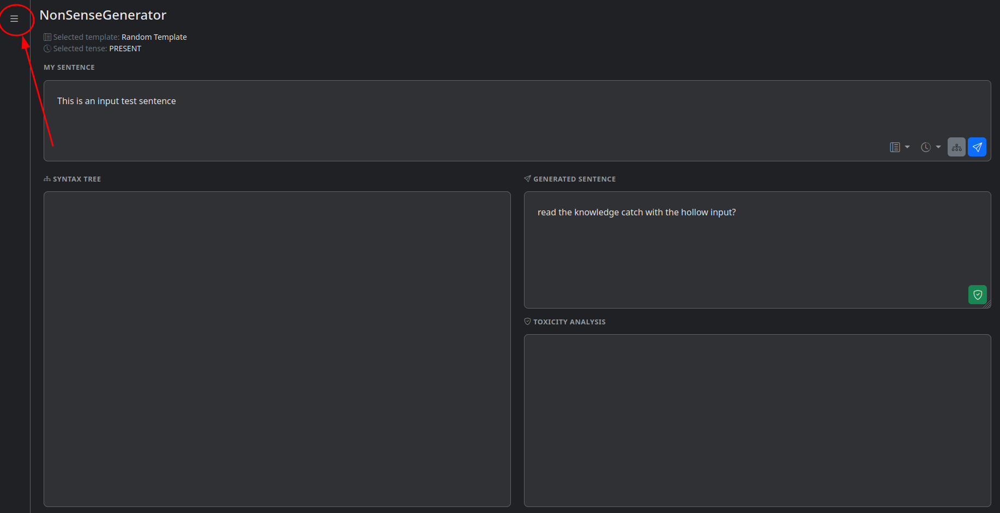

# Official NonSenseGenerator manual
## Project Description
NonSenseGenerator is a web application that allows users to generate nonsensical sentences based on their input.<br>
It uses Google's Natural Language API to analyze sentence structure.<br>
It provides features for syntax analysis, sentence generation, toxicity analysis, and a public history log of generated sentences.<br>
The application is designed to be intuitive and user-friendly.<br>
## Technology Stack Used
The NonSenseGenerator application is built using a combination of frontend and backend technologies, libraries, and plugins. 
<br>Below is a summary of the tech stack:

| Layer                         | Technology                   | Version             |
| ----------------------------- | ---------------------------- | ------------------- |
| Backend                       | Java                         | 21                  |
| Backend                       | Spring Boot                  | 3.1.4               |
| Build & Dependency Management | Maven                        | (Managed by Spring) |
| Backend                       | Thymeleaf                    | (Managed by Spring) |
| Libraries (UI/UX)             | Bootstrap                    | 5.3.3               |
| Libraries (DOM)               | jQuery                       | 3.7.1               |
| Libraries (Charts)            | Chart.js                     | 4.5.0               |
| Chart.js Plugins              | Chart.js Chart Graphs Plugin | 1.0.1               |
| Chart.js Plugins              | Chart.js Data Labels Plugin  | 2.2.0               |
| Libraries (Java)              | JSON                         | 20250517            |
| Libraries (Java)              | Dotenv                       | 3.0.0               |
| Testing                       | JUnit 5                      | (Managed by Spring) |
| Documentation                 | MkDocs                       | 1.6.1               |

### External APIs
The application integrates with the following external APIs:

| API Name                | Provider     | Purpose                                                                                           |
| ----------------------- | ------------ | ------------------------------------------------------------------------------------------------- |
| documents.analyzeSyntax | Google Cloud | Analyzes the syntax of sentences by providing<br> a syntax tree and part-of-speech tags.          |
| documents.moderateText  | Google Cloud | Analyzes the toxicity of sentences to determine<br> if they contain harmful or offensive content. |

### The project APIs
The NonSenseGenerator application provides its own API for generating nonsensical sentences and analyzing syntax under the `/api/v1/nonsense` path.<br>
The following table summarizes the available APIs, which are used by the frontend to interact with the backend.


| API Name                              | Method | Parameters                                                                         | Purpose                                                                                                                           |
| ------------------------------------- | ------ | ---------------------------------------------------------------------------------- | --------------------------------------------------------------------------------------------------------------------------------- |
| /api/v1/nonsense/sentence/syntax      | GET    | `sentence` (string)                                                                | Analyzes the syntax of a sentence by providing<br> a syntax tree and part-of-speech tags.                                         |
| /api/v1/nonsense/sentence/generate    | GET    | `sentence` (string)<br>`template` (string, optional)<br>`tense` (string, optional) | Generates a nonsensical sentence based on the provided input.<br> It can use a pre-defined template or let the system choose one. |
| /api/v1/nonsense/sentence/toxicity    | GET    | `sentence` (string)                                                                | Analyzes the toxicity of a generated sentence to determine<br> if it contains harmful or offensive content.                      |
| /api/v1/nonsense/dictionary/templates | GET    | None                                                                               | Retrieves a list of pre-defined templates for sentence generation.                                                                |
| /api/v1/nonsense/history/generated    | GET    | `amount` (integer)                                                                 | Retrieves a list of previously generated sentences.<br> The `amount` parameter specifies how many sentences to retrieve.          |

## Installation
To install and run the NonSenseGenerator application, follow these steps:

### Prerequisites

- **Java 21 or higher**:
    - Check if you have Java installed by running:
    ```bash
    java -version
    ```
    - If not installed, download and install it from [Oracle's official website](https://www.oracle.com/java/technologies/javase-jdk21-downloads.html) or use your OS package manager.

- **Maven** (not mandatory, since it's provided in the project through the `nonsense/mvnw` wrapper for Linux and MacOS or `nonsense\mvnw.cmd` for Windows)

- A **Google Cloud account** with the Natural Language API enabled
    - Follow the instructions in the [Google Cloud documentation](https://cloud.google.com/natural-language/docs/setup) to set up your account and enable the API.
    - IMPORTANT: Create the `.env` file
    - Obtain your API key and set it as an environment variable inside `.env`:
    - Store the file in both of the following directories:
        - the `nonsense` directory
        - the `nonsense/src/main/resources` directory
    - The `.env` file should contain the following line, replacing `your_api_key_here` with your actual API key:
    ```bash
    GOOGLE_NLP_API_KEY="your_api_key_here"
    ```

### Installation Steps
1.  **Clone the repository:**
    ```bash
    git clone https://github.com/liamtoaldo/NonSenseGenerator.git
    ```

2.  **Navigate to the project directory:**
    ```bash
    cd NonSenseGenerator
    cd nonsense
    ```
3. **Choose your installation method:**
#### Running without building
It's recommended if you are a developer and want to run the application and make changes to the code.

4.  **Run the application:**
    - If you have Maven installed, run:
    ```bash
    mvn spring-boot:run
    ```
    - If you are using the provided wrapper, run:
    ```bash
    ./mvnw spring-boot:run  # For Linux and MacOS
    mvnw.cmd spring-boot:run  # For Windows
    ```
#### Building and running the application
It's recommended if you are a user and want to just use the application.

4. **Build the application:**
    - If you have Maven installed, run:
    ```bash
    mvn clean package
    ```
    - If you are using the provided wrapper, run:
    ```bash
    ./mvnw clean package  # For Linux and MacOS
    mvnw.cmd clean package  # For Windows
    ```
    - If you get errors because of tests, you can skip them by adding the `-DskipTests` flag
5. **Run the application:**
    ```bash
    java -jar target/nonsense-0.0.1-SNAPSHOT.jar
    ```
## Usage
Once the application is running, you can access it in your web browser at `http://localhost:8080`
### Syntax Analysis
To analyze the syntax of a sentence, enter the sentence in the input field and click the "Analyze Syntax" button. The application will display the syntax tree and part-of-speech tags for each word in the sentence.
<br>
<br>

<br>
<br>
Root nodes are red, regardless of their part of speech.<br>
Child nodes are colored based on their part of speech:

- Nouns: Purple
- Verbs: Green
- Adjectives: Yellow
- Everything else: Blue<br>

### Sentence Generation
To generate a nonsensical sentence, enter a sentence in the input field and click the "Generate" button.<br>
You can select a pre-defined template or let the system choose one for you.<br>
You can also choose the generated sentence's tense (present, past, or future) or use present tense by default.<br>
The application will display the generated sentence in the output field.
<br>
<br>

<hr>

### Toxicity Analysis
To analyze the toxicity of a sentence after generating it, click the "Analyze Toxicity" button inside the generated sentence field.<br>
A list of toxicity categories will be displayed, along with their scores.<br>
The categories include:

- **Toxic** - Overall toxicity score
- **Insult** - Score for insulting language
- **Profanity** - Score for profanity
- **Derogatory** - Score for derogatory language
- **Sexual** - Score for sexual content
- **Death, Harm & Tragedy** - Score for content related to death, harm, or tragedy
- **Violent** - Score for violent content
- **Firearms & Weapons** - Score for content related to firearms and weapons
- **Public Safety** - Score for content that may affect public safety
- **Health** - Score for content that may affect health
- **Religion & Belief** - Score for content related to religion and belief
- **Illicit Drugs** - Score for content that contains illicit drugs terminology
- **War & Conflict** - Score for content related to war and conflict
- **Politics** - Score for content related to politics
- **Finance** - Score for content that contains financial terminology
- **Legal** - Score for content related to legal terminology


### Visualizing the Private History
To visualize the private history of generated sentences, click the three horizontal lines in the top left corner of the page.<br>
You will see a list of all generated sentences, click on one's green button to see its details and open it on the page so you can analyze the syntax of the input sentence, view the generated sentence, and analyze its toxicity.<br>


<hr>


### Visualizing the Public History
To visualize the public history of generated sentences, click the three horizontal lines in the top left corner of the page.<br>
You will see a big button labeled "Global Generations" in the menu.<br>
Click it to see a list of all generated sentences by all users along with the generation date and a button to copy it.<br>


<hr>

<hr>

